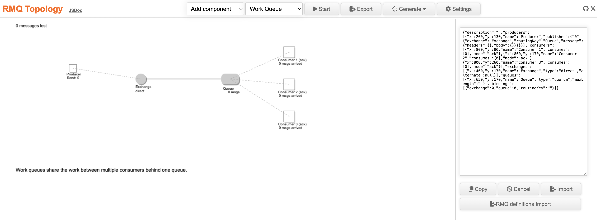

# RMQ Topology

A small tool to simulate RabbitMQ topologies and see the message flow.  
Have several examples of common use cases and messaging patterns.  
It creates cURL, rabbitmqadmin, Terraform and AsyncAPI definitions.  

[Demo Page](https://dbproductions.github.io/rmq-topology/)

## Import/Export
It's possible to export and import the definitions in a JSON format.  
RabbitMQ schema definitions can be imported, but not all features are supported.

## Used technologies
The project uses [Rollup](https://rollupjs.org/), [ESLint](https://eslint.org/), [Prettier](https://prettier.io/) and [JSDoc](https://jsdoc.app/) with the [clean-jsdoc-theme](https://ankdev.me/clean-jsdoc-theme/).  
[Vitest](https://vitest.dev/) and [Cypress](https://www.cypress.io/) run some tests.  

### Node

    node -v
    v21.5.0
    npm i

    npm run bundle
    npm start

### Bun

    bun -v
    1.2.13
    bun i
    bun run bundle    
    bun run start

### Deno

    deno -v
    deno 2.3.1
    deno install

    deno task bundle
    deno task start

After a successful start the specific runtime serves the tool under `http://localhost:3000/`.

## Feedback
Star this repo if you found it useful. Use the github issue tracker to give feedback on this repo.