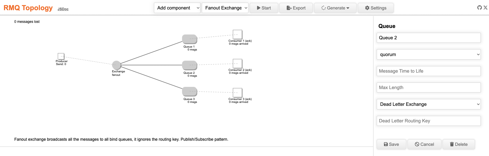

# RMQ Topology

A small tool to simulate RabbitMQ topologies and see the message flow.  
Have several examples of common use cases and messaging pattern.  
It creates curl, rabbitmqadmin, Terraform and AsyncAPI.  

[Demo Page](https://dbproductions.github.io/rmq-topology/)

The project uses [Rollup](https://rollupjs.org/), [ESLint](https://eslint.org/), [Prettier](https://prettier.io/) and [JSDoc](https://jsdoc.app/) with the [clean-jsdoc-theme](https://ankdev.me/clean-jsdoc-theme/). [Cypress](https://www.cypress.io/) runs some tests.  

    node -v
    v20.10.0
    npm i

    npm run bundle
    npm start

    http://localhost:3000/

## Feedback
Star this repo if you found it useful. Use the github issue tracker to give feedback on this repo.